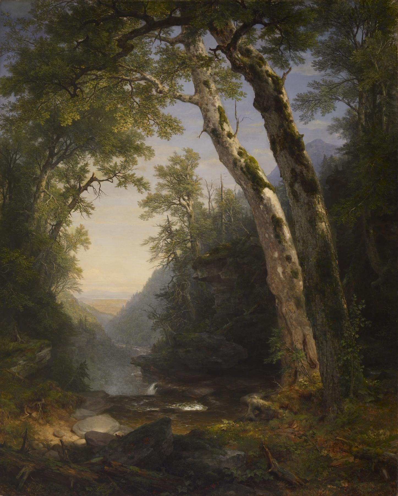

# Hatchat Color Scheme and Design

## Inspiration

The color palette is derived from Asher Brown Durand's painting "The Catskills" (1859):



*Asher Brown Durand - The Catskills - Walters Art Museum*

This Hudson River School landscape provides earthy, calm tones that feel adult and understated—a deliberate contrast to the bright, playful colors typical of modern chat applications like Slack.

## Design Principles

- **Light mode primary** with warm, calm tones
- **Dark sidebar** for contrast and visual anchoring
- **Barely rounded corners** (`2px`) throughout—architectural but not harsh
- **Minimal shadows**—use subtle borders instead
- **Square and understated** where Slack is rounded and playful
- **WCAG AA accessible** contrast ratios for all text

## Color Palette

| Name | Hex | Swatch | Role |
|------|-----|--------|------|
| Coco's Black | `#1F1C1A` |  | Sidebar background, primary text, modal overlay |
| Graphite | `#3B3823` |  | Reserved for future use |
| Mushroom Forest | `#8D7C55` |  | Borders/dividers (at ~30% opacity) |
| Another One Bites the Dust | `#C6B7A0` |  | Page background, sidebar section headers |
| Shadow of the Colossus | `#A4A0A1` |  | Muted text (timestamps, hints) |
| Your Shadow | `#78798B` |  | Reserved (originally sidebar, failed accessibility) |
| Stone Cold | `#5B5958` |  | Secondary text, input borders |
| Peat Brown | `#54311C` |  | Primary buttons, links, accents |

**Additional colors:**

| Role | Hex | Swatch |
|------|-----|--------|
| Off-white (content background) | `#FAF9F7` |  |
| Pure white (input backgrounds) | `#FFFFFF` |  |

## Accessibility

Contrast ratios were validated for WCAG AA compliance (minimum 4.5:1 for normal text):

| Text Color | Background | Ratio | Status |
|------------|------------|-------|--------|
| Off-white (`#FAF9F7`) | Coco's Black (`#1F1C1A`) | 16.10:1 | ✓ AAA |
| Coco's Black (`#1F1C1A`) | Off-white (`#FAF9F7`) | 16.10:1 | ✓ AAA |
| Stone Cold (`#5B5958`) | Off-white (`#FAF9F7`) | 6.62:1 | ✓ AA |
| Peat Brown (`#54311C`) | Off-white (`#FAF9F7`) | 10.89:1 | ✓ AAA |

**Note:** Your Shadow (`#78798B`) was originally planned for the sidebar but failed accessibility testing (4.07:1 ratio with off-white text). We switched to Coco's Black instead.

## Color Mapping

| UI Element | Color |
|------------|-------|
| Page background | `#C6B7A0` (Dust) |
| Content area background | `#FAF9F7` (Off-white) |
| Sidebar background | `#1F1C1A` (Coco's Black) |
| Primary text | `#1F1C1A` (Coco's Black) |
| Secondary text | `#5B5958` (Stone Cold) |
| Muted text (timestamps) | `#A4A0A1` (Shadow of the Colossus) |
| Primary buttons/links | `#54311C` (Peat Brown) |
| Sidebar text | `#FAF9F7` (Off-white) |
| Sidebar section headers | `#C6B7A0` (Dust) |
| Borders/dividers | `#8D7C55` at 30% opacity |
| Active channel (sidebar) | `rgba(255, 255, 255, 0.15)` overlay |

## Layout Structure

### Main Chat Interface

```
┌─────────────────────────────────────────────────────────┐
│  Page background (#C6B7A0) - visible as subtle frame    │
│  ┌────────────┬────────────────────────────────────┐    │
│  │            │  Chat header (#FAF9F7)             │    │
│  │  Sidebar   │  ─────────────────────────────────│    │
│  │  (#1F1C1A) │                                    │    │
│  │            │  Messages area (#FAF9F7)           │    │
│  │  Channels  │                                    │    │
│  │  Actions   │                                    │    │
│  │            │  ─────────────────────────────────│    │
│  │            │  Input bar                         │    │
│  └────────────┴────────────────────────────────────┘    │
└─────────────────────────────────────────────────────────┘
```

### Login/Register Page

```
┌─────────────────────────────────────────────────────────┐
│                                                         │
│           Page background (#C6B7A0)                     │
│                                                         │
│           ┌─────────────────────────┐                   │
│           │  Card (#FAF9F7)         │                   │
│           │                         │                   │
│           │  Hatchat 🪓             │                   │
│           │                         │                   │
│           │  [Sign in] [Register]   │  ← tabs           │
│           │                         │                   │
│           │  Username               │                   │
│           │  [ input ]              │                   │
│           │                         │                   │
│           │  Password               │                   │
│           │  [ input ]              │                   │
│           │                         │                   │
│           │  [ Submit ]             │                   │
│           └─────────────────────────┘                   │
│                                                         │
└─────────────────────────────────────────────────────────┘
```

## Component Specifications

### Buttons

**Primary:**
- Background: `#54311C` (Peat Brown)
- Text: `#FAF9F7` (off-white)
- Border radius: `2px`
- Hover: 10% darker (`#3d2415`)

**Secondary:**
- Background: transparent
- Border: 1px `#5B5958` (Stone Cold) at 50% opacity
- Text: `#5B5958`
- Border radius: `2px`
- Hover: slightly darker border

**Danger:**
- Background: `#a83232`
- Text: off-white
- Border radius: `2px`

### Inputs

- Background: `#FFFFFF`
- Border: 1px `#5B5958` at 50% opacity
- Border radius: `2px`
- Focus state: border becomes `#54311C` (Peat Brown)

### Sidebar Channels

**Active channel:**
- Background: `rgba(255, 255, 255, 0.15)` (subtle white overlay)
- Text: `#FAF9F7` (off-white)
- Font weight: 600
- Border radius: `2px`

**Inactive channel:**
- Background: transparent
- Text: `rgba(250, 249, 247, 0.8)` (off-white at 80%)
- Hover: `rgba(255, 255, 255, 0.1)` background

### Message Avatars

- Colored squares (existing behavior)
- Border radius: `2px`

### Modals

- Background: `#FAF9F7` (off-white)
- Border: 1px `#8D7C55` at 30% opacity
- Border radius: `2px`
- Overlay: `#1F1C1A` (Coco's Black) at 50% opacity
- No box-shadow

## CSS Custom Properties

All colors are defined as CSS custom properties in both `style.css` and `chat.css`:

```css
:root {
  --color-coco-black: #1F1C1A;
  --color-graphite: #3B3823;
  --color-mushroom-forest: #8D7C55;
  --color-dust: #C6B7A0;
  --color-shadow-colossus: #A4A0A1;
  --color-your-shadow: #78798B;
  --color-stone-cold: #5B5958;
  --color-peat-brown: #54311C;
  --color-off-white: #FAF9F7;
  --color-white: #FFFFFF;
}
```

## Future Considerations

- Typography refinement (font choices, sizing, line-height)
- Avatar colors could shift toward this palette
- Dark mode variant using the darker colors from the palette
